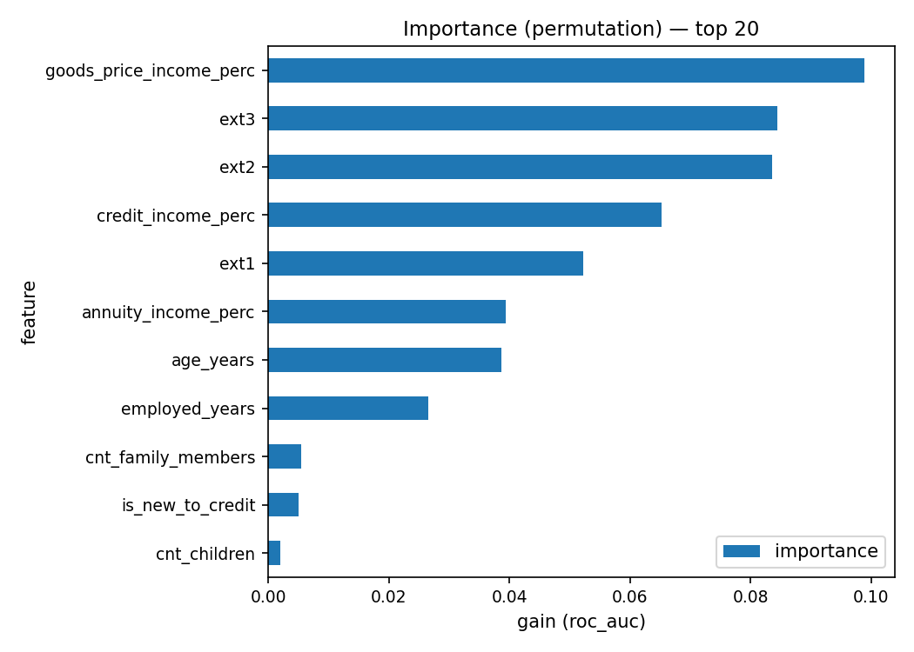
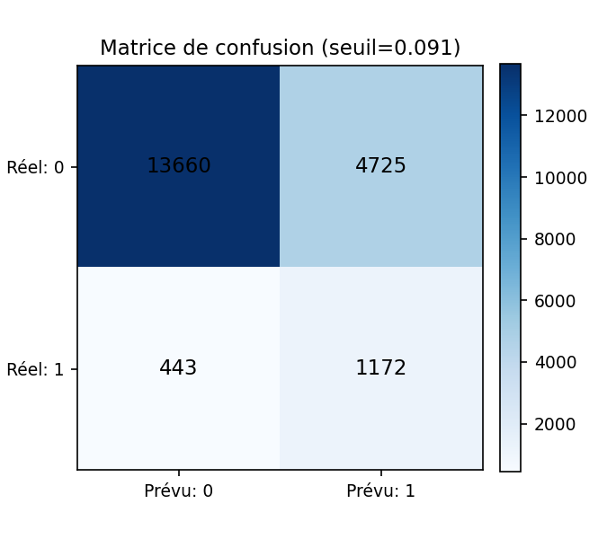

# Rapport modèle — LGBM (20250905-165406)

## Paramètres clés

- **Seuil figé**: `0.091` (FN=10.0×, FP=1.0×)
- **Features**: 11
- **Fichier train**: `train_features_v1.csv`
- **Échantillon importance**: 20000 dossiers

## Lock-test (tenu à part)

- Coût total: **16609.0**  |  **Coût/1000**: **540.09**
- Rappel: **0.634**  |  Précision: **0.173**  |  F1: **0.272**
- TP=1573  FP=7509  FN=910  TN=20760  (n=30752)

## Échantillon interne (pour visuels)

- Coût/1000 (échantillon): **457.75**  (TP=1172, FP=4725, FN=443, TN=13660, n=20000)

### Importances

### Matrice de confusion

## Top 20 features

| feature                 |   importance |
|:------------------------|-------------:|
| goods_price_income_perc |     0.098887 |
| ext3                    |     0.084435 |
| ext2                    |     0.083504 |
| credit_income_perc      |     0.065251 |
| ext1                    |     0.052271 |
| annuity_income_perc     |     0.039356 |
| age_years               |     0.038732 |
| employed_years          |     0.026478 |
| cnt_family_members      |     0.005533 |
| is_new_to_credit        |     0.005081 |
| cnt_children            |     0.001972 |

